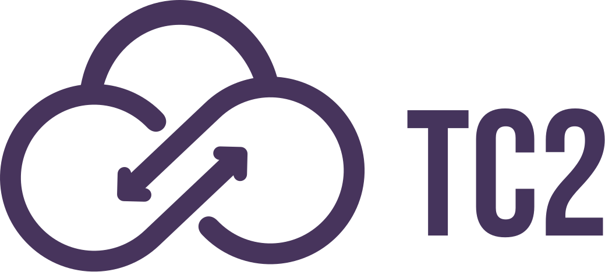
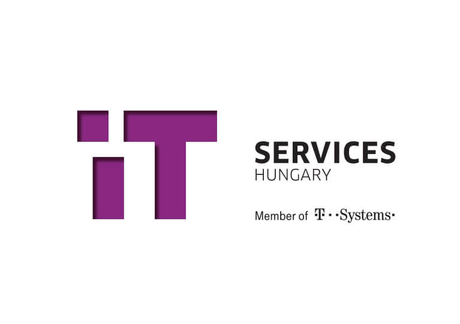

# Sandor Kosztka

_Cloud Architect in Budapest, Hungary_  

[Email](mailto:sandor.kosztka@gmail.com) / [~~Website~~](https://cv.ksztk.hu/) / [LinkedIn](https://www.linkedin.com/in/kosztkas/) / [GitHub](http://git.io/sztk)

## Experience

### **Cloud Architect** @ [Deutsche Telekom IT Solutions](https://www.deutschetelekomitsolutions.hu/) _(Jan 2025 - present)_   
Cloud Services   
Network, backup and generic cloud platform related solutions in multiple projects as an architect.

**_Technologies:_** Terraform, Terragrunt, **AWS**, Network, Linux
  

### **Cloud Architect** @ [TC2](https://tc2.hu/) _(Oct 2023 - Dec 2024)_   
Consultancy team   
As a member of the consultancy team, I was acting as a bridge between the operations team and the customer. My responsibilities included conducting regular cost and security reviews of customer AWS environments, and I frequently created and presented these reviews. 
Additionally, I scheduled and planned operations and development tasks, and I actively participated in the delivery process using Terraform / Terragrunt.  
I also served as a subject matter expert for backup solutions, particularly for creating AWS Backup-based solutions for various AWS resource and SAP database backups.

**_Technologies:_** Terraform, **AWS**, Veeam, Linux
  

### **Cloud Architect** @ [Invitech](https://invitech.hu/) _(Jan 2020 - Sep 2023)_  
Enterprise Solutions - Cloud  
  - Tested and deployed a new KVM solution for our datacenter services
  - Providing thought leadership for overall AWS architecture, testing and deployment
  - Training colleagues on the fundamentals of containerization and Kubernetes
  - Supporting Veeam deals and solutions on TDA level
  - Building a new Kubernetes product
  - Creating short lightboard videos explaining our solutions technological concepts on a high level 
  
**_Technologies used:_** Veeam, AWS, Ansible, Kubernetes
  

### **Cloud Specialist** @ [British Telecom](https://bt.com/) _(May 2019 - Jan 2020)_  
Cloud Managed Services  
 - I was a subject matter expert for cloud product development
 - Developed automation and design for our Alibaba cloud offering product launch. 
 - Contributed to the development of the SSO for the multi cloud solution.  
  (With Python, Terraform and Resource Orchestration Service /ROS/ templates)
 - Configured Cloudyn reports (for MS Azure Billing and AWS)  
 
 **_Technologies used:_** Alibaba Cloud, MS Azure, AWS, Cloudyn, SAML
  

### **Solution Consultant** @ [Vodafone](https://www.vodafone.com/) _(Jan 2017 - Apr 2019)_  
Cloud & Security Services  
- Translated complex customer requirements into feasible technical solution in form of high-level designs. 
- Reviewed customers’ current infrastructure and proposed modernization or upgrade opportunities. 
- Enabled sales by providing design and indicative prices.
- Created and managed proof of concept environments for customers on dedicated private cloud product. 
- Tested and provided feedback for the product development teams.
- Held workshops and demos about different cloud solutions and automation.

**_Technologies used:_** Alibaba Cloud, AWS, Python, Ansible, Terraform, Docker
  

### **Linux Engineer** @ [IT Services Hungary](https://www.deutschetelekomitsolutions.hu/) _(Oct 2012 - Jan 2017)_  
Solutions & Projects  
 - Supported multiple projects by managing their VMware environments and Linux systems also supporting Docker. 
 - Worked closely with the development teams, fulfilling their infrastructure requirements. 
 - Built a monitoring system for the Docker container environment using Nagios and custom bash scripts. Started automating tasks with Ansible.

**_Technologies used:_** VMware, Linux, Docker, Nagios
  

**Network Administrator** @ [IT Services Hungary](https://www.deutschetelekomitsolutions.hu/)  
Internal IT  
Maintained the user plane equipment - configured access ports, VoIP phone ports, spec patches, wireless Access Points (Prime mgmt & WLC).  
Continued to carry out selected sysadmin activities based on expertise. Started to support projects.

**_Technologies used:_** VMware, Linux, Cisco iOS, Avaya phones
  

**Sysadmin trainee** @ [IT Services Hungary](https://www.deutschetelekomitsolutions.hu/)  
Internal IT  
 - Managed the centralized HP Printing system, AD and DNS services
 - Participated in the VMware vSphere system administration
 - Administered our Corporate File Share – DFS
 - Created a Release Management process for our team
 - Participated in the monthly patching of Windows servers (win2008R2, win2012)

**_Technologies used:_** VMware, Linux, Windows, Nagios, DFS, AD
  

## On The Side

**Mentor** @ [Flow Academy](https://www.flowacademy.hu//) _(Jan 2022 - Present)_  
Mentoring in the fundamentals of Ansible and public clouds (AWS)  
Creating course materials, excercises and holding lectures online  
Creating and grading exams
 

**Research Assistant** @ [Budapest University of Technology and Economics](https://www.bme.hu//) _(Feb 2022 - June 2022)_  
 Consulting on the Training Project Laboratory course for the semester  
 Planned exercises in Docker and Kubernetes  
 Rated the course final papers
  
        
## Certifications
 - [AWS Certified: Advanced Networking – Specialty](https://www.credly.com/earner/earned/badge/22aea656-9547-469b-8560-11fa12227933)
 - [AWS Certified: Solutions Architect – Professional](https://www.credly.com/badges/9f5efe5b-193c-41e9-8b43-b6f94724b275)
 - [AWS Certified: Solutions Architect – Associate](https://www.credly.com/badges/831b71a6-20f1-4eeb-805b-a44df4bc566d)
 - [AWS Certified: SAP on AWS - Specialty](https://www.credly.com/badges/ad98188d-9284-4703-8e98-61a7276e7a99)
 - [Veeam Certified Engineer 2024 (VMCE 2024) v12.1](https://www.credly.com/badges/dbbd8c44-6132-46ad-a544-dc682cebea54)

 

## Awards
 - [Alibaba Cloud MVP](https://mvp.alibabacloud.com/mvp/detail/163) 2018 / 2019 / 2020

## Languages
**Hungarian**: Native  
**English**: Full professional proficiency
  

## Education
**Bachelor of Profession, Computer Science**  
Budapest University of Technology and Economics - 2023  
Major in Testing and Operation

**Bachelor of Science, Computer Engineering**  
Budapest University of Technology and Economics  

**Electrician**  
National Register of Vocational Qualifications - 2022

  

